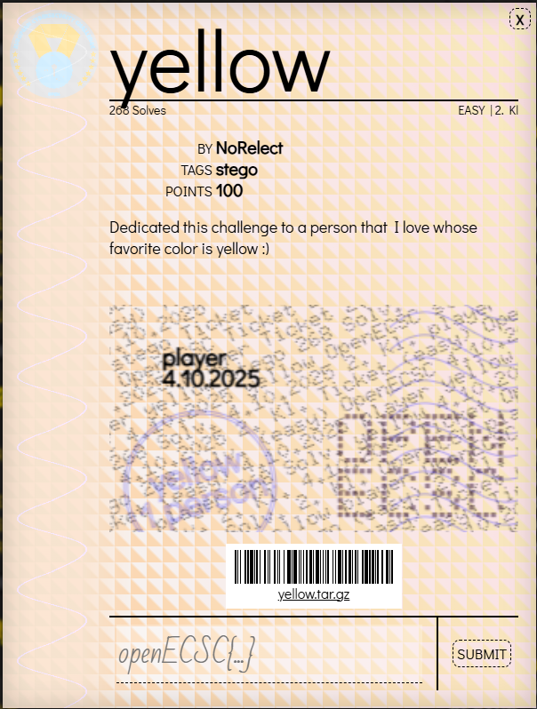

# Challenge: Yellow

**YELLOW (4/10)**: https://openec.sc/#challenges



## Resumen
Se entrega un archivo `yellow.png`. El reto pertenece a la categoría de esteganografía y consiste en analizar la imagen para encontrar información oculta.

## Datos proporcionados

Archivo asociado: `CTF3\resources\yellow.png`

## Análisis inicial

El archivo es una imagen PNG completamente amarilla, lo que sugiere que la información oculta no se encuentra en los píxeles.  
Por lo tanto, se exploraron otras posibilidades, como metadatos o manipulación de los *chunks* del formato PNG.

## Exploración de los chunks PNG

Cada archivo PNG contiene una serie de **chunks** (IHDR, IDAT, IEND, etc.).  
Se desarrolló un pequeño script en Python para listar los tipos de chunks y sus longitudes:

## Implementación (Python)
La implementación se encuentra en el archivo [`script.py`](./script.py).

El script incluye:
- Lectura de `yellow.png` como bytes y parsing simple de los chunks PNG
- Recorre los chunks y recolecta las longitudes de los chunks `IDAT`
- Convierte las longitudes imprimibles (32-126) a caracteres ASCII y monta una cadena
- Busca un posible token/flag del tipo `{...}` dentro de la cadena decodificada e intenta mostrarla

Para ejecutar:
```bash
python script.py
```

## Resultado

El resultado mostró muchos chunks IDAT (más de los normales para una imagen simple), con longitudes poco comunes.
Al observar esas longitudes, se notó un patrón: correspondían a valores ASCII imprimibles.

Al decodificar esas longitudes se obtuvo la flag:

```
openECSC{W3_4l1_l1v3_1n_4_y3ll0w_subm4r1n3}
```
Al observar esas longitudes, se notó un patrón: correspondían a valores ASCII imprimibles.

y se obtuvo `openECSC{W3_4l1_l1v3_1n_4_y3ll0w_subm4r1n3}`